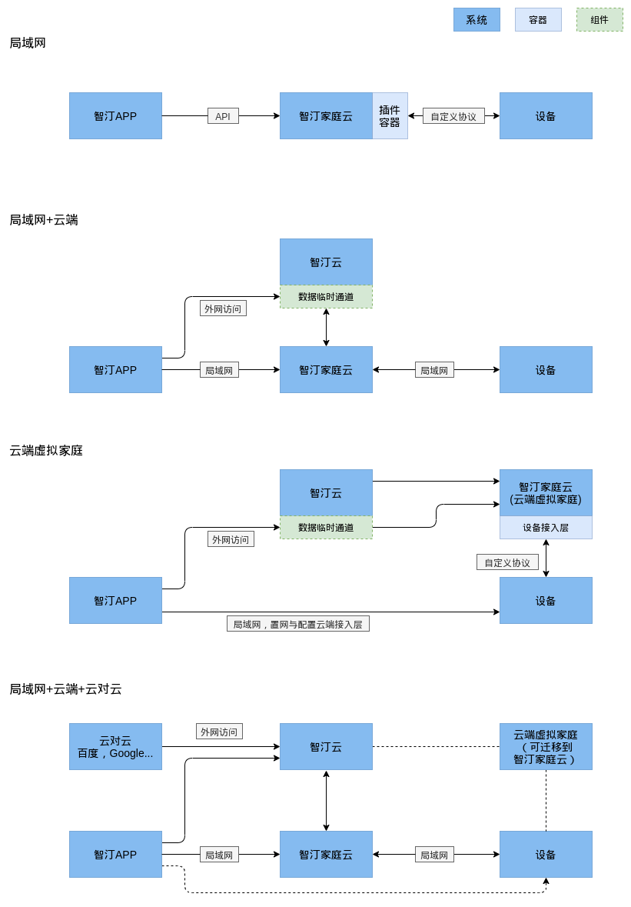

# 架构概述

智汀家庭云（SmartAssistant，简称 SA），立项于2021年，结合国内智能家居各厂商软件特点，研发“智汀家庭云”，并对该生态系统全面开源，为国内首个采用智能家居系统全生态开源协议（Apache License, Version 2.0）的软件。

## 应用场景

智汀家庭云可以离线运行在局域网内，也可以通过绑定到智汀云来获取更强大的功能。

运行在局域网环境时，用户可以通过智汀APP发现与管理智汀家庭云，安装插件来对设备进行管理与控制。

用户也可以通过在智汀云上面注册帐号，将智汀家庭云设备关联到云端，然后通过云端中转的方式支持在外网对设备进行控制。

智汀云同时提供设备直接接入云端虚拟家庭的功能，方便无智汀家庭云设备的用户使用；智汀云也提供虚拟家庭数据迁移到实体家庭的接口。

对于关联到云端的家庭，智汀云提供云对云接入功能，用户可授权小度，天猫精灵，Google Nest 等智能音箱直接对设备进行控制。



在开发过程中需要注意的是，任何情况下，用户的隐私都是最重要的，因此需保证只有在用户授权的情况下，第三方才可访问智汀家庭云；用户也可对第三方的授权进行控制。

## 架构概述

智汀家庭云运行在 Linux 主机下（默认为 OpenWRT），通过 Docker 来对其中的服务进行部署与资源隔离。其中部分核心服务容器通过docker-compose.yaml配置，
并且随系统启动自动运行；而插件（plugin）类服务则是由 SA 调用 docker API 的方式进行管理。

插件启动后会运行一个 gRPC 服务以及一个可选的 HTTP 服务，SA 通过 docker API 监听插件运行状态，
通过 gRPC 接口获取插件信息


## 功能模块

智汀家庭云模块拆分为 internal 与 pkg 两个分组，其中 internal 为与项目业务逻辑相关性比较强功能模块分组；pkg 包含与业务关系不大的通用组件。其引用关系如下图所示：


其中比较重要的业务模块如下：


## 程序设计的规则参考

* 基础模块使用单例模式实例化，但应避免直接使用全局变量，可使用 entity.DB() 的形式做一层封装; 懒汉模式延迟初始化应使用 sync.Once
* 基础模块只依赖其他基础模块，不应涉及业务逻辑
* 简单的业务模块（譬如只依赖基础模块），可直接使用单例模式，或者通过容器模块（app，command，server 等）进行实例化
* 依赖其他业务模块，或者两个模块间可能会进行相互调用而导致循环引用的，使用控制反转（依赖注入）技术进行处理，由容器模块进行实例化
* 应用内避免使用 eventbus 等 pubsub 模型进行模块解耦；如需使用 pubsub，请在 event 包中对事件类型、消息进行预定义；禁止为了方便而直接使用 Bus.Pub("my_event", data) 的形式
* 尽量避免使用 init，应显式地在外层调用相关的 InitXXX() 函数

## 目录结构

项目源码结构参考 [Standard Go Project Layout](https://github.com/golang-standards/project-layout) ；代码组织形式参考 [Clean Architecture]()

```text
├── app.yaml            运行时配置文件
├── app.yaml.example    配置文件范例
├── build               打包相关的脚本
│   ├── docker
│   └── docs
├── cmd
│   └── smartassistant 入口命令
├── docs                文档
│   ├── guide
│   ├── images
│   └── tutorial
├── internal
│   ├── api       接口
│   │   ├── area
│   │   ├── brand
│   │   ├── cloud
│   │   ├── device
│   │   ├── location
│   │   ├── middleware
│   │   ├── page
│   │   ├── role
│   │   ├── scene
│   │   ├── scope
│   │   ├── session
│   │   ├── test
│   │   ├── user
│   │   └── utils
│   │       ├── cloud
│   │       └── response
│   ├── cloud
│   ├── config
│   ├── entity
│   ├── plugin
│   │   ├── docker
│   │   └── mocks
│   ├── task
│   ├── types
│   │   └── status
│   ├── utils
│   │   ├── hash
│   │   ├── jwt
│   │   ├── session
│   │   └── url
│   └── websocket
├── pkg         通用组件代码
│   ├── errors
│   ├── proxy
│   ├── rand
│   └── reverseproxy
├── static
├── Makefile            make 配置
└── README.md           项目介绍文档
```

## 运行时目录

为了方便对智汀家庭云以及各扩展、插件数据进行管理，/build/install/install.sh 脚本进行初始化时会生成以下结构的运行时目录；如果您以其他方式运行智汀家庭云，
也建议遵循以下目录结构：

```text
├── docker-compose.yaml 容器启动配置文件
├── backup  备份目录
├── config  配置目录
│   ├── certs 证书目录
│   ├── fluentd.conf
│   ├── nginx_smartassistant.conf
│   └── smartassistant.yaml
├── data  数据目录
│   ├── plugin  插件数据目录
│   │   ├── HomeKit
│   │   ├── LIFX
│   │   └── PHILIPS hue
│   └── smartassistant 智汀家庭云数据目录
└── log 日志目录

```

如果您想进一步了解项目开发相关的内容，请参考[如何参与项目](./contributing.md)。
